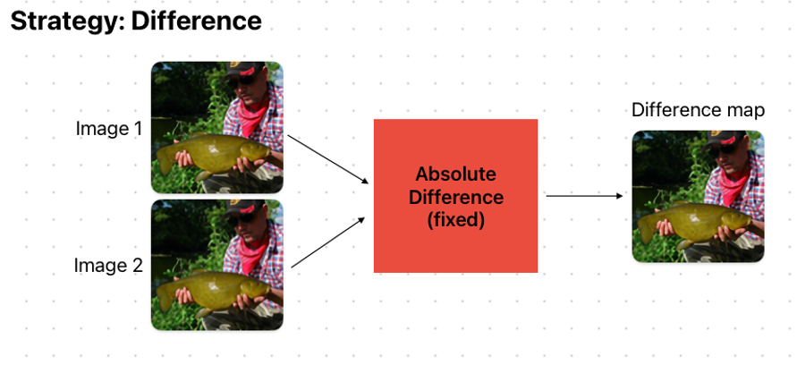

# Difference Finder


* This is my side-work. I'll improve the figure during my next free time 😅

This repository is for finding difference between two images automatically using pytorch.

<br />

## Motivation
With the extensive exploration of machine learning techniques, the quality of reconstructed images has reached a saturation point. Consequently, comparing baseline methods has become challenging. While quantitative evaluations may indicate marginal improvements, demonstrating qualitative enhancements has been difficult (in my experience).

<br />


## What you can do
Given two images, this repo provides the difference map. See the below examples.

<br />

### Example 1. Hard "spot the difference" (ref: https://thetem.co.kr/article/%EC%8A%A4%ED%86%A0%EB%A6%AC/2/1801/)

There are *seven* different spots. 
Try by yourself before seeing the result!

Image 1 | Image 2
:-------------------------:|:-------------------------:
  | 


### Result.

Strategy: Difference | Strategy: Gradient /  Metric: PSNR
:------------------:|:---------------------------------:
 | 


<br />

### Example 2. Complex "spot the difference" (ref: https://www.pinterest.co.kr/pin/312578030384336039/)

There are *seven* different spots. 
Try by yourself before seeing the result!

Image 1 | Image 2
:-------------------------:|:-------------------------:
  | 


### Result.

Strategy: Difference | Preprocess: HP filter / Strategy: Gradient /  Metric: SSIM
:------------------:|:---------------------------------:
 | 


<br />

## Developed modules & Futher plan


```
[Pre-processor]
    [x] identity (default)
    [x] normalize
    [x] highpass_filter
    [x] lowpass_filter
    [ ] wavelet

[Post-processor]
    [x] identity (default)
    [ ] dynamic thresholding

[Metric]
    [x] MSE
    [x] PSNR
    [x] SSIM
    [x] MS-SSIM
    [x] LPIPS
    [ ] DICE score
    [ ] JACCARD score

[Strategy]
    [x] Difference
    [x] Gradient (default)
    [ ] GradCAM
```

<br />

## How to use

### pre-requisite
- pytorch > 0.7.0
- numpy
- pillow
- pytorch_msssim
- lpips

### Usage

It would be simple. Just follow the three steps!

1. Define 'Finder'
2. Give two image paths to compare
3. Done!


```
from pathlib import Path
from difference_finder.finder import Finder

img1_path = Path('./samples/imgdir1/img1.png')
img2_path = Path('./samples/imgdir2/img2.png')

worker = Finder(strategy='gradient', metric='psnr')
output = worker.run(img1_path, img2_path)
```


If two image directories are given, it will generate difference map for all files.
(The number of files should be the same.)

```
from pathlib import Path
from difference_finder.finder import Finder

img1_directory = Path('./samples/imgdir1/')
img2_directory = Path('./samples/imgdir2/')

worker = Finder(strategy='gradient', metric='psnr')
outputs = worker.run(img1_directory, img2_directory)
```

<br />

## Principle

So... how does it work? Extremely simple.


When you set the strategy as 'difference', it simply return the l1 difference (i.e. absolute value of pixel-wise difference), regardless to given metric option.
Actually, this is the straightforward and intuitive way to get the difference map.


When you set the strategy as 'gradient', it will calculate the gradient of one of input image with respect to calculated (scalar) metric. One pixel of returned gradient indicates "how much the pixel contributes to the metric". Hence, the metric function **must be differentiable** by the pytorch auto-grad backend. It is required to construct all metric functions using the pytorch.
